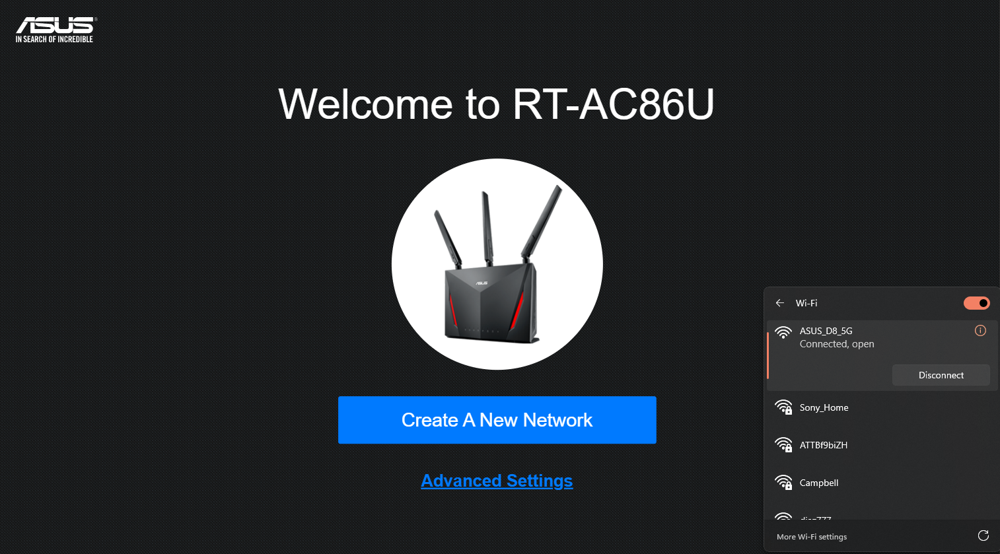

# Capturing Beamforming Feedback Information (BFI) using TP-Link Archer T2U Plus and ASUS RT-AC86U on Ubuntu

---

## 📘 Overview

This repository documents **the complete process of capturing Beamforming Feedback Information (BFI)** from a Wi-Fi 5 (802.11ac) network using:

- **Receiver:** TP-Link Archer T2U Plus (RTL8821AU chipset)
- **Transmitter (Access Point):** ASUS RT-AC86U Dual-Band MU-MIMO Router
- **Capture System:** Surface Laptop running Ubuntu 24.04

The guide is written to help **any researcher, developer, or student** replicate the entire procedure — from hardware setup and driver installation to BFI packet capture and extraction.

---

## 🧩 What This Repository Contains

- 📄 **How_to_Capture_BFI.md** — The complete 2000-word step-by-step guide with all terminal commands and troubleshooting notes.
- 📸 **Example screenshots** showing:
  - USB device detection
  - Driver loading and Wi-Fi interfaces
  - ASUS router setup and beamforming configuration
  - Packet capture verification in Wireshark
- 🧪 Example capture file: `bfi_capture.pcapng`
- ✅ Output format and post-processing example in MATLAB using `pcap_to_bfa.m`

---

## 🧠 Goal

To create a reproducible and open procedure that demonstrates **how to extract and study BFI (Beamforming Feedback Information)** from 802.11ac routers, which can later be used for:
- Gesture recognition,
- Wi-Fi sensing,
- Environmental mapping, or
- Cross-domain learning.

---

## ⚙️ System Setup Summary

### **Hardware Used**
| Component | Model | Purpose |
|------------|--------|----------|
| Router | ASUS RT-AC86U | Beamforming transmitter |
| USB Adapter | TP-Link Archer T2U Plus (RTL8821AU) | Receiver / monitor mode capture |
| Laptop | Microsoft Surface Go 3 (Ubuntu 24.04) | Capture and analysis system |

---

## 🖧 Ubuntu Wi-Fi Setup

### 1️⃣ Detect the TP-Link Adapter
```bash
lsusb
```
Expected output:
```
Bus 003 Device 006: ID 2357:0120 TP-Link Archer T2U PLUS [RTL8821AU]
```
📷 *Reference:* 

---

### 2️⃣ Install Required Packages and Driver
```bash
sudo apt update
sudo apt install -y dkms git build-essential
git clone https://github.com/morrownr/8821au-20210708.git
cd 8821au-20210708
sudo ./install-driver.sh
```
If `Secure Boot` is enabled, enroll the MOK key and reboot.

✅ Confirm driver loaded:
```bash
lsmod | grep 8821
iwconfig
```
📷 *Reference:* Screenshot from 2025-10-30 14-28-15.png

---

## 📡 ASUS Router Configuration

### 1️⃣ Initial Setup
Visit:
```
http://router.asus.com
```
or
```
192.168.50.1
```

If prompted, choose:
```
→ Choose Operation Mode
→ Wireless Router Mode (Default)
```

Create a new SSID:
```
SSID: ASUS_BFI_5G
Password: bfiproject123
```
📷 *Reference:* Screenshot 2025-10-29 153234.png

---

### 2️⃣ Enable Beamforming
Navigate to:
```
Advanced Settings → Wireless → Professional Tab (5GHz)
```
Enable:
- Explicit Beamforming ✅
- Implicit Beamforming ✅
- MU-MIMO ✅
- TX Beamforming ✅

📷 *Reference:* Screenshot from 2025-10-30 15-02-47.png

---

### 3️⃣ Set Channel and Bandwidth
Under **Wireless → General → Band (5GHz)**:
| Setting | Value |
|----------|--------|
| Wireless Mode | 802.11ac only |
| Channel Bandwidth | 80 MHz |
| Control Channel | 149 |
| Authentication | WPA2-Personal |
| Encryption | AES |

📷 *Reference:* Screenshot from 2025-10-30 15-02-47.png

---

## 🔗 Connecting TP-Link to ASUS Router

List available networks:
```bash
sudo nmcli device wifi list ifname wlxb01921e7721f
```

Connect:
```bash
sudo nmcli device wifi connect "ASUS_BFI_5G" password "bfiproject123" ifname wlxb01921e7721f
```

Verify connection:
```bash
nmcli device
iwconfig wlxb01921e7721f
```
📷 *Reference:* Screenshot from 2025-10-30 16-37-52.png

---

## 🛰️ Capturing BFI Packets

### 1️⃣ Switch to Monitor Mode
```bash
sudo ip link set wlxb01921e7721f down
sudo iw dev wlxb01921e7721f set type monitor
sudo ip link set wlxb01921e7721f up
```
Check:
```bash
iwconfig
```

---

### 2️⃣ Generate Traffic
Run:
```bash
ping -i 0.1 192.168.50.1
```
or for continuous high load:
```bash
iperf3 -c 192.168.50.1 -t 120
```

---

### 3️⃣ Capture the Traffic
```bash
sudo tcpdump -i wlxb01921e7721f -w bfi_capture.pcapng
```
When done, stop with `Ctrl + C`.
Check the file:
```bash
ls -lh ~/bfi_capture.pcapng
```
📷 *Reference:* Screenshot from 2025-10-30 16-37-52.png

---

## 🧪 Inspecting the Capture in Wireshark

Open file:
```bash
wireshark ~/bfi_capture.pcapng &
```

In the filter bar, type:
```
wlan.vht
```
Inspect packets under:
```
IEEE 802.11 → IEEE 802.11ac VHT Information
```
Look for:
- VHT Beamforming Report
- Compressed Beamforming Feedback
- Channel Sounding
- MCS/NSS fields

📷 *Reference:* Screenshot from 2025-10-30 16-37-52.png

---

## 💾 Extracting BFI Matrices in MATLAB

Transfer the `.pcapng` file to your MATLAB environment and run:
```matlab
BFI = pcap_to_bfa('bfi_capture.pcapng');
```
You’ll get:
```
/beam_angles/
/exclusive_bf_reports/
/vtilde_matrices/
```
These contain the BFI matrices for further ML or sensing applications.

---

## 🧰 Troubleshooting

| Issue | Cause | Fix |
|--------|--------|-----|
| TP-Link not detected | USB driver missing | Run `lsusb` → reinstall RTL8821AU driver |
| No packets captured | Not in monitor mode | Run `iw dev ... set type monitor` again |
| No `wlan.vht` frames | Router not in 802.11ac mode | Force 5GHz, 80MHz channel |
| MATLAB errors | No feedback frames | Generate traffic during capture |
| Wireshark shows only IP packets | Capture from wrong interface | Use the TP-Link interface, not Intel’s |

---

## 🧩 Example Artifacts

| Screenshot | Description |
|-------------|-------------|
| Screenshot 2025-10-29 135918.png | Initial ASUS router login |
| Screenshot 2025-10-29 153234.png | Router network creation |
| Screenshot from 2025-10-30 13-03-17.png | TP-Link detected via `lsusb` |
| Screenshot from 2025-10-30 14-28-15.png | Driver installed and interface shown |
| Screenshot from 2025-10-30 15-02-47.png | Router 5GHz configuration |
| Screenshot from 2025-10-30 16-37-52.png | BFI capture and Wireshark view |

---

## 🧠 Acknowledgments

This setup and documentation were tested using:
- Ubuntu 24.04 LTS
- TP-Link Archer T2U Plus (RTL8821AU)
- ASUS RT-AC86U Router (802.11ac)
- Surface Go 3 Laptop

The process has been validated to generate BFI frames suitable for MATLAB extraction and Wi-Fi sensing research.

---

## 🧾 License

This repository is released under the **MIT License** for educational and research purposes.

---

## 🏁 Citation

If you use this setup or documentation in your research, please cite:
```
Bismoy, M. I. (2025). Capturing Beamforming Feedback Information (BFI) using TP-Link Archer T2U Plus and ASUS RT-AC86U on Ubuntu.
GitHub repository: https://github.com/MuttakiIslamBismoyBracu18/Capture_BFI_Ubuntu
```
---
